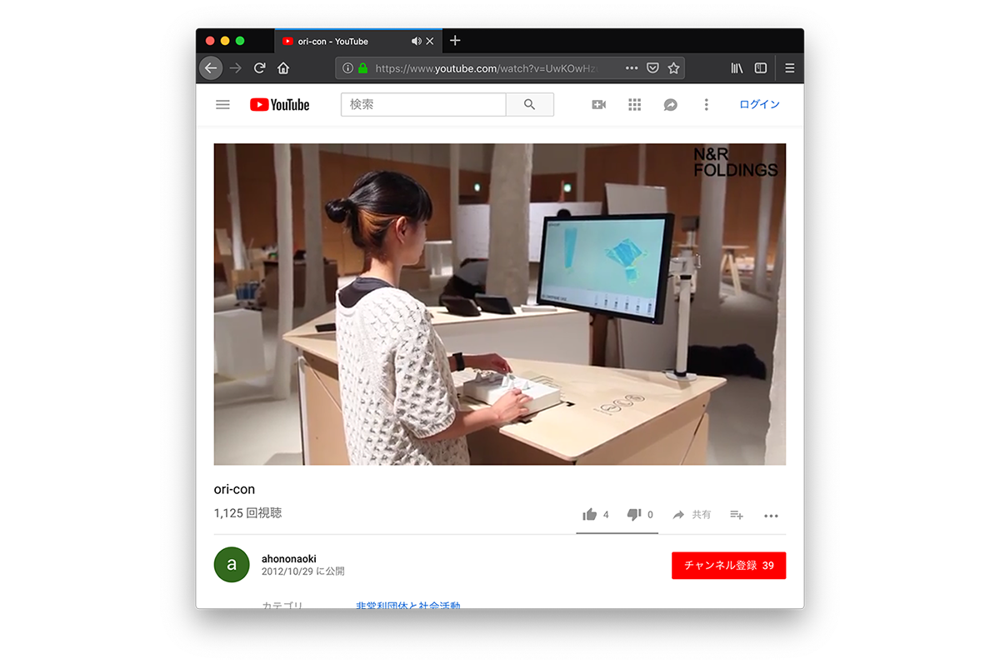

# ghx3DVJ  

### Physical Computing / Modeling Tool for 3D VJ  

  

僕が好んで使っている Grasshopper で VJ ツールを作った（ている）。  
Rhino を使っているので、3D オブジェクトを弄りやすい。ちょっと便利だと思います。  
速度とか、不安定な FPS とかその辺がネックになるカモ...  

  

w/ Rhinoceros 5, Grasshopper 0.9, gHowl, Firefly, Processing 2, and Arduino  

---  

### Hardware  

  

秋月で可変抵抗を買った。  
スライダーのもの（100円）と、つまみを回すもの(40円)。  
どちらも10kΩ  

これから出てくる値を、analogRead() で取得し、コンピュータに流す。  

あとは、その辺に落ちてた Arduino Uno、導線、ピンヘッダ、ブレッドボード、ジャンプワイヤ、抵抗を使った。  

---  

### Connection  

Arduino でシリアルを吐くようにしているので、Grasshopper の Serial のアドオンか、Python コンポーネントでやれると思ってた。  

Serial のアドオンでは、アクセス拒否とかいうので、撤退。  

Python コンポーネントで、while をまわす。同じコードを、.py にしてコマンドプロンプトではちゃんと動くが、Grasshopper の方では、異様に重い。  

実装が冗長になるが、一回、Processing で、Serial を読んで、OSC に送る方法で解決...  

イーサネットのシールドがあると、Arduino から、OSC が使えるっぽい。

---  

### Ori-Con

Reference というか、僕の個人的に結構衝撃だったプロダクトのイメージがまずあって、3D ジオメトリとフィジカルコンピューティングのネタをいつかやりたかった。  

[https://www.youtube.com/watch?v=UwKOwHzuAqo](https://www.youtube.com/watch?v=UwKOwHzuAqo)  

  

---  

### Ref  

ProcessingとArduinoを接続する(yoppa.org)  
[https://yoppa.org/tau_bmaw13/4772.html](https://yoppa.org/tau_bmaw13/4772.html)  

oscいろいろ(processing,openFrameworks,Puredata)(Sako.log)  
[http://www.everykz.com/blog/2013/08/24/157](http://www.everykz.com/blog/2013/08/24/157)  
