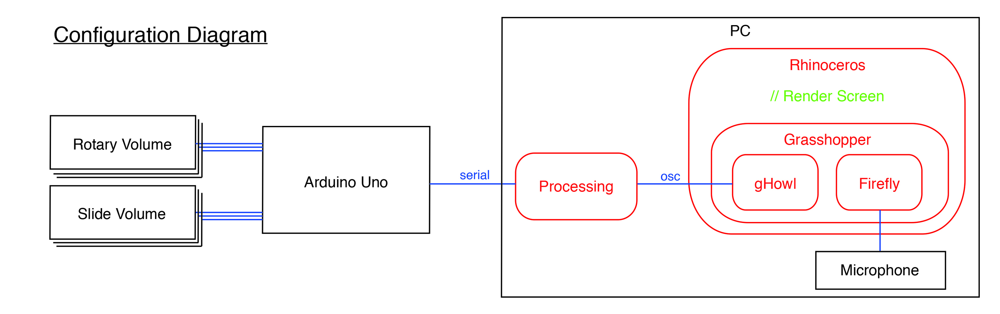

# ghx3DVJ  

### Physical Computing / Modeling Tool for 3D VJ  

  

僕が好んで使っている Grasshopper で VJ ツールを作った（ている）。  
Rhino を使っているので、3D オブジェクトを弄りやすい。ちょっと便利だと思います。  
速度とか、不安定な FPS とかその辺がネックになるカモ...  

  

w/ Rhinoceros 5, Grasshopper 0.9, gHowl, Firefly, Processing 2, and Arduino  


---  


### Hardware  

  

秋月で可変抵抗を買った。  
スライダーのもの（100円）と、つまみを回すもの(40円)。  
どちらも10kΩ  

これから出てくる値を、analogRead() で取得し、コンピュータに流す。  

あとは、その辺に落ちてた Arduino Uno、導線、ピンヘッダ、ブレッドボード、ジャンプワイヤ、抵抗を使った。  


---  


### Connection  

Arduino でシリアルを吐くようにしているので、Grasshopper の Serial のアドオンか、Python コンポーネントでやれると思ってた。  

Serial のアドオンでは、アクセス拒否とかいうので、撤退。  

Python コンポーネントで、while をまわす。同じコードを、.py にしてコマンドプロンプトではちゃんと動くが、Grasshopper の方では、異様に重い。  

実装が冗長になるが、一回、Processing で、Serial を読んで、OSC に送る方法で解決...  

イーサネットのシールドがあると、Arduino から、OSC が使えるっぽい。  


シリアル通信についてもう少し。  
田所先生の ProcessingとArduinoを接続する（[https://yoppa.org/tau_bmaw13/4772.html](https://yoppa.org/tau_bmaw13/4772.html)）では、Arduino と Processing で相互でやりとりしてセンサーの値を送っている。  

>今回のシリアル送受信には「ハンドシェイキング(handshaking)」という手法を使用してみます。ハンドシェイキングとは、2点間の通信路を確立した後、本格的に通信を行う前に事前のやり取りを自動的に行うことをいいます。実際の通信を行う前に、まず握手(ハンドシェイク)を行うイメージです。ハンドシェイキングした後は、通常の情報の転送を行います。  

ハンドシェイキングということをやっているらしい。  
yoppa.org の図を参照。  

P → A  
P ← A  
P → A  
P ← A  

ググるとこんな感じ↓   

> ハンドシェイク（フロー制御）  
機器同士がデータの送受信を行う場合、受信側が受信状態でない場合にデータを送信するとデータが失われる可能性があるため、通信では、お互いの状態を確認することが重要です。ハンドシェイク（フロー制御は通信の信頼性を確保する機能で、送信側から受信側に「データ送信中」という信号を送り、受信側はその信号を受け、信号線からデータを読み込みます。そして送信側へ「データを受信しました」という返事をします。つまり、互いにデータの送受信を確認しあいつつデータを転送することができます。  
シリアル通信の基礎知識より  ([https://www.contec.com/jp/support/basic-knowledge/daq-control/serial-communicatin/](https://www.contec.com/jp/support/basic-knowledge/daq-control/serial-communicatin/)）  

無駄がない、失敗のない方法だと思った。（提出後に知った）  


あと、Processing での受け取り方についてももう少し。  
Processing で draw じゃなく serialEvent で作った方が良い？   

```java

// ex1

void setup(){
  size(100,100);
}

void draw(){
}

void serialEvent(Serial myPort) {
  myString = myPort.readStringUntil('\n');

}
```


```java

// ex2

void setup(){
  size(100,100);
}

void draw(){
  myString = myPort.readStringUntil('\n');

}
```

今度調べる。  
ex1 のほうでは、draw とは別に、シリアルが流れてくるのを待ち続ける？  
ex2 のほうでは、draw のループのタイミングに依存する？  


---  


### Ori-Con

Reference というか、僕の個人的に結構衝撃だったプロダクトのイメージがまずあって、3D ジオメトリとフィジカルコンピューティングのネタをいつかやりたかった。  

[https://www.youtube.com/watch?v=UwKOwHzuAqo](https://www.youtube.com/watch?v=UwKOwHzuAqo)  

  


---  


### Ref  


ProcessingとArduinoを接続する(yoppa.org)  
[https://yoppa.org/tau_bmaw13/4772.html](https://yoppa.org/tau_bmaw13/4772.html)  

oscいろいろ(processing,openFrameworks,Puredata)(Sako.log)  
[http://www.everykz.com/blog/2013/08/24/157](http://www.everykz.com/blog/2013/08/24/157)  
